# Database Schema Overview

本文档说明 `backend/employment.db` (SQLite) 的数据库结构。

---

## ER Diagram

```mermaid
erDiagram
    UNIVERSITIES {
        text university_id PK "University ID (e.g. UNI001)"
        text name "University Name"
        text province "Province"
        text city "City"
        text type "University Type"
        text created_at
        text updated_at
    }

    COLLEGE_EMPLOYMENT {
        text record_id PK "Record ID (UUID)"
        text university_id FK "University ID -> universities"
        text college_name "College Name (院系名称)"
        int graduation_year "Graduation Year (毕业年份)"
        text degree_level "Degree Level: 本科生/硕士生/博士生"
        text graduation_type "Graduation Type: 毕业/结业"
        int graduate_nums "Total Graduates (毕业人数)"
        int employed_nums "Employed Count (就业数)"
        int contract_nums "Signed Contract Count (签约人数)"
        int total_graduate_school_nums "Total Graduate School (总升学人数)"
        int domestic_graduate_school_nums "Domestic Graduate School (境内升学人数)"
        int overseas_graduate_school_nums "Overseas Graduate School (境外升学人数)"
        text created_at
        text updated_at
    }

    REGIONAL_FLOW {
        text record_id PK "Record ID (UUID)"
        text university_id FK "University ID -> universities"
        text degree_level "Degree Level: 本科毕业生/毕业研究生"
        int graduation_year "Graduation Year (毕业年份)"
        int east_nums "East Region Count (东部地区人数)"
        int central_nums "Central Region Count (中部地区人数)"
        int west_chongqing_nums "West-Chongqing Count (西部地区-重庆市人数)"
        int west_sichuan_nums "West-Sichuan Count (西部地区-四川省人数)"
        int west_other_nums "West-Other Count (西部地区-其他省区人数)"
        int hmt_nums "HK/Macau/Taiwan Count (港澳台及其他人数)"
        int total_nums "Total Count (统计总数)"
        text created_at
        text updated_at
    }

    STUDENT_EMPLOYMENT_CHOICE {
        text choice_id PK "Choice Record ID (UUID)"
        text gender "Gender (性别: 男/女)"
        text major "Major (专业)"
        text degree "Degree (学历)"
        text employment_direction "Employment Direction (毕业去向)"
        text industry "Industry (就业行业)"
        real expected_salary "Expected Salary (期望薪资)"
        text work_city "Work City (工作城市)"
        text satisfaction_score "Satisfaction Score (满意度评分: 1-5 或 差)"
        text has_internship "Has Internship (是否有实习经历: 是/否)"
        text internship_city "Internship City (实习城市, 仅部分记录有)"
        text created_at
        text updated_at
    }

    ACCOUNTS {
        text account_id PK "Account ID (UUID)"
        text username "Username (用户名)"
        text password_hash "Password Hash (密码哈希)"
        text real_name "Real Name (真实姓名)"
        text email "Email"
        text phone "Phone (电话)"
        text role "Role (角色)"
        int status "Account Status (状态)"
        int login_attempts "Login Attempts (登录尝试次数)"
        text locked_until "Locked Until (锁定截止时间)"
        text last_login "Last Login Time (最后登录时间)"
        text created_at
        text updated_at
    }

    STUDENT_PROFILES {
        text profile_id PK "Profile ID (UUID)"
        text account_id FK "Account ID -> accounts"
        text university_id FK "University ID -> universities"
        text student_no "Student Number (学号)"
        text college "College (学院)"
        text major "Major (专业)"
        int degree "Degree Level (学历: 1=本科, 2=硕士, 3=博士)"
        int graduation_year "Graduation Year (毕业年份)"
        text province_origin "Origin Province (生源省份)"
        text gpa "GPA (绩点)"
        text skills "Skills (技能)"
        text internship "Internship Experience (实习经历)"
        int employment_status "Employment Status (就业状态)"
        text desire_city "Desired City (期望城市)"
        text desire_industry "Desired Industry (期望行业)"
        int desire_salary_min "Min Desired Salary (最低期望薪资)"
        int desire_salary_max "Max Desired Salary (最高期望薪资)"
        text cur_company "Current Company (当前公司)"
        text cur_city "Current City (当前城市)"
        text cur_industry "Current Industry (当前行业)"
        int cur_salary "Current Salary (当前薪资)"
        text resume_url "Resume URL (简历链接)"
        int profile_complete "Profile Complete % (简历完整度)"
        text live_city_id "Living City ID (现居城市ID)"
        text desire_jd_salary_id "Desired JD Salary ID (期望JD薪资ID)"
        text created_at
        text updated_at
    }

    COMPANIES {
        text company_id PK "Company ID (UUID)"
        text account_id FK "Account ID -> accounts"
        text company_name "Company Name (公司名称)"
        text industry "Industry (所属行业)"
        text city "City (城市)"
        text size "Company Size (公司规模)"
        text description "Description (公司简介)"
        int verified "Verified Status (认证状态)"
        text created_at
        text updated_at
    }

    COMPANY_ACTIVITIES {
        text activity_id PK "Activity ID (UUID)"
        text company_id FK "Company ID -> companies"
        text type "Activity Type (活动类型)"
        text title "Title (活动标题)"
        text location "Location (活动地点)"
        date activity_date "Activity Date (活动日期)"
        time start_time "Start Time (开始时间)"
        time end_time "End Time (结束时间)"
        text description "Description (活动描述)"
        smallint status "Status (状态)"
        int expected_num "Expected Participants (预期参与人数)"
        int actual_num "Actual Participants (实际参与人数)"
        text type_name "Type Name (类型名称)"
        text created_at
        text updated_at
    }

    COMPANY_ANNOUNCEMENTS {
        text announcement_id PK "Announcement ID (UUID)"
        text company_id FK "Company ID -> companies"
        text title "Title (公告标题)"
        text content "Content (公告内容)"
        text target_major "Target Major (目标专业)"
        smallint target_degree "Target Degree (目标学历)"
        int headcount "Headcount (招聘人数)"
        date deadline "Deadline (截止日期)"
        smallint status "Status (状态)"
        text published_at "Published At (发布时间)"
        text created_at
        text updated_at
    }

    JOB_DESCRIPTIONS {
        text job_id PK "Job ID (UUID)"
        text company_id FK "Company ID -> companies"
        text title "Job Title (职位名称)"
        text city "City (工作城市)"
        text province "Province (省份)"
        text industry "Industry (行业)"
        int min_salary "Min Salary (最低薪资)"
        int max_salary "Max Salary (最高薪资)"
        int min_degree "Min Degree (最低学历要求)"
        int min_exp_years "Min Experience Years (最低工作年限)"
        text keywords "Keywords (关键词)"
        text description "Description (职位描述)"
        int status "Status (状态)"
        text published_at "Published At (发布时间)"
        text expired_at "Expired At (过期时间)"
        text jd_sub_type "JD Sub Type (JD子类型)"
        int require_nums "Required Number (招聘人数)"
        int is_travel "Is Travel Required (是否出差)"
        text max_edu_level "Max Education Level (最高学历要求)"
        text resume_language_required "Resume Language Required (简历语言要求)"
        text created_at
        text updated_at
    }

    JOB_APPLICATIONS {
        text application_id PK "Application ID (UUID)"
        text job_id FK "Job ID -> job_descriptions"
        text account_id FK "Account ID -> accounts"
        int status "Application Status (申请状态)"
        text created_at
        text updated_at
    }

    USER_JOB_PREFERENCE {
        text preference_id PK "Preference ID (UUID)"
        text user_id FK "User ID -> student_profiles"
        text desire_city_ids "Desired City IDs (期望城市IDs)"
        text desire_industry_ids "Desired Industry IDs (期望行业IDs)"
        int desire_salary_min "Min Desired Salary (最低期望薪资)"
        int desire_salary_max "Max Desired Salary (最高期望薪资)"
        text created_at
    }

    USER_JOB_EXPOSURE {
        text exposure_id PK "Exposure ID (UUID)"
        text user_id FK "User ID -> student_profiles"
        text job_id FK "Job ID -> job_descriptions"
        text exposure_type "Exposure Type (曝光类型)"
        text created_at
    }

    USER_JOB_SATISFACTION {
        text satisfaction_id PK "Satisfaction ID (UUID)"
        text user_id FK "User ID -> student_profiles"
        text job_id FK "Job ID -> job_descriptions"
        int satisfied "Satisfied (是否满意: 0/1)"
    }

    USER_SKILLS {
        text skill_id PK "Skill ID (UUID)"
        text user_id FK "User ID -> student_profiles"
        text skill_name "Skill Name (技能名称)"
        text source "Source (来源)"
    }

    EMPLOYMENT_WARNINGS {
        text warning_id PK "Warning ID (UUID)"
        text account_id FK "Account ID -> accounts"
        text university_id FK "University ID -> universities"
        text warning_type "Warning Type (预警类型)"
        int level "Warning Level (预警等级)"
        text ai_suggestion "AI Suggestion (AI建议)"
        int handled "Handled (是否处理: 0/1)"
        text handled_at "Handled At (处理时间)"
        text created_at
        text updated_at
    }

    CITY_MAPPING {
        int city_id PK "City ID (城市ID)"
        text city_code "City Code (城市代码)"
        text city_name "City Name (城市名称)"
        text province "Province (所属省份)"
    }

    SCARCE_TALENTS {
        text talent_id PK "Talent ID (UUID)"
        text province "Province (省份)"
        text job_type "Job Type (岗位类型)"
        int shortage_level "Shortage Level (紧缺程度)"
        text industry "Industry (行业)"
        int data_year "Data Year (数据年份)"
        text source "Source (数据来源)"
        text created_at
        text updated_at
    }

    KNOWLEDGE_DOCUMENTS {
        text doc_id PK "Document ID (UUID)"
        text title "Title (文档标题)"
        text doc_type "Document Type (文档类型)"
        text collection "Collection (知识库集合)"
        text source "Source (来源)"
        int chunk_count "Chunk Count (文本块数量)"
        int indexed "Indexed (是否已索引: 0/1)"
        text created_at
        text updated_at
    }

    AI_ANALYSIS_RECORDS {
        text record_id PK "Record ID (UUID)"
        text account_id FK "Account ID -> accounts"
        text analysis_type "Analysis Type (分析类型)"
        text input_data "Input Data (输入数据)"
        text output_data "Output Data (输出数据)"
        int tokens_used "Tokens Used (使用Token数)"
        int duration_ms "Duration ms (耗时毫秒)"
        int status "Status (状态)"
        text created_at
        text updated_at
    }

    OPERATION_LOGS {
        int log_id PK "Log ID (自增)"
        text account_id FK "Account ID -> accounts"
        text action "Action (操作动作)"
        text resource "Resource (操作资源)"
        text ip_address "IP Address (IP地址)"
        text user_agent "User Agent (浏览器UA)"
        int result "Result (操作结果: 0=失败, 1=成功)"
        text created_at
        text updated_at
    }

    SYSTEM_CONFIGS {
        text config_key PK "Config Key (配置键)"
        text config_value "Config Value (配置值)"
        text description "Description (配置描述)"
        text updated_at
    }

    REFRESH_TOKENS {
        text token_id PK "Token ID (UUID)"
        text account_id FK "Account ID -> accounts"
        text token_hash "Token Hash (Token哈希)"
        text device_info "Device Info (设备信息)"
        text ip_address "IP Address (IP地址)"
        text expires_at "Expires At (过期时间)"
        int revoked "Revoked (是否撤销: 0/1)"
        text created_at
        text updated_at
    }

    ALEMBIC_VERSION {
        text version_num "Version Number (迁移版本号)"
    }

    SQLITE_SEQUENCE {
        text name "Table Name"
        int seq "Sequence Value"
    }

    UNIVERSITIES ||--o{ COLLEGE_EMPLOYMENT : "has"
    UNIVERSITIES ||--o{ REGIONAL_FLOW : "has"
    UNIVERSITIES ||--o{ STUDENT_PROFILES : "has"
    UNIVERSITIES ||--o{ EMPLOYMENT_WARNINGS : "warned for"

    ACCOUNTS ||--o{ STUDENT_PROFILES : "has"
    ACCOUNTS ||--o{ COMPANIES : "has"
    ACCOUNTS ||--o{ JOB_APPLICATIONS : "submits"
    ACCOUNTS ||--o{ AI_ANALYSIS_RECORDS : "analyzed by AI"
    ACCOUNTS ||--o{ OPERATION_LOGS : "operated by"
    ACCOUNTS ||--o{ REFRESH_TOKENS : "holds"

    COMPANIES ||--o{ COMPANY_ACTIVITIES : "hosts"
    COMPANIES ||--o{ COMPANY_ANNOUNCEMENTS : "publishes"
    COMPANIES ||--o{ JOB_DESCRIPTIONS : "posts"

    STUDENT_PROFILES ||--o{ USER_JOB_PREFERENCE : "has"
    STUDENT_PROFILES ||--o{ USER_JOB_EXPOSURE : "exposed to jobs"
    STUDENT_PROFILES ||--o{ USER_JOB_SATISFACTION : "rates jobs"
    STUDENT_PROFILES ||--o{ USER_SKILLS : "owns"

    JOB_DESCRIPTIONS ||--o{ JOB_APPLICATIONS : "received"
    JOB_DESCRIPTIONS ||--o{ USER_JOB_EXPOSURE : "exposed to"
    JOB_DESCRIPTIONS ||--o{ USER_JOB_SATISFACTION : "rated by"

    ACCOUNTS ||--o{ CHAT_SESSIONS : "has"
    CHAT_SESSIONS ||--o{ CHAT_MESSAGES : "contains"
```

---

## Data Tables (业务数据表)

### 1. universities (高校表)

高校基础信息。

| 字段          | 类型 | 说明                   |
| ------------- | ---- | ---------------------- |
| university_id | TEXT | 高校ID (PK)            |
| name          | TEXT | 高校名称               |
| province      | TEXT | 所在省份               |
| city          | TEXT | 所在城市               |
| type          | TEXT | 高校类型 (综合/理工等) |

### 2. college_employment (学院就业明细表)

各学院各学历层次的就业明细数据。**核心数据表**。

| 字段                          | 类型    | 说明                            |
| ----------------------------- | ------- | ------------------------------- |
| record_id                     | TEXT    | 记录ID (PK, UUID)               |
| university_id                 | TEXT    | 高校ID (FK)                     |
| college_name                  | TEXT    | 学院名称                        |
| graduation_year               | INTEGER | 毕业年份                        |
| degree_level                  | TEXT    | 学历层次 (本科生/硕士生/博士生) |
| graduation_type               | TEXT    | 毕业/结业                       |
| graduate_nums                 | INTEGER | 毕业人数                        |
| employed_nums                 | INTEGER | 就业人数                        |
| contract_nums                 | INTEGER | 签约人数                        |
| total_graduate_school_nums    | INTEGER | 总升学人数                      |
| domestic_graduate_school_nums | INTEGER | 境内升学人数                    |
| overseas_graduate_school_nums | INTEGER | 境外升学人数                    |

**数据来源**: 文件9 (各学院毕业去向与落实情况合并表) **记录数**: 472条

### 3. regional_flow (区域流向表)

各学历层次毕业生就业区域流向分布。

| 字段                | 类型    | 说明                             |
| ------------------- | ------- | -------------------------------- |
| record_id           | TEXT    | 记录ID (PK, UUID)                |
| university_id       | TEXT    | 高校ID (FK)                      |
| degree_level        | TEXT    | 学历层次 (本科毕业生/毕业研究生) |
| graduation_year     | INTEGER | 毕业年份                         |
| east_nums           | INTEGER | 东部地区人数                     |
| central_nums        | INTEGER | 中部地区人数                     |
| west_chongqing_nums | INTEGER | 西部地区-重庆市人数              |
| west_sichuan_nums   | INTEGER | 西部地区-四川省人数              |
| west_other_nums     | INTEGER | 西部地区-其他省区人数            |
| hmt_nums            | INTEGER | 港澳台及其他人数                 |
| total_nums          | INTEGER | 统计总数                         |

**数据来源**: 文件6 (区域流向情况统计表) **记录数**: 10条

### 4. student_employment_choice (学生就业选择表)

学生就业选择调查数据。

| 字段                 | 类型 | 说明                            |
| -------------------- | ---- | ------------------------------- |
| choice_id            | TEXT | 记录ID (PK, UUID)               |
| gender               | TEXT | 性别 (男/女)                    |
| major                | TEXT | 专业                            |
| degree               | TEXT | 学历                            |
| employment_direction | TEXT | 毕业去向 (公务员/创业/出国等)   |
| industry             | TEXT | 就业行业                        |
| expected_salary      | REAL | 期望薪资 (整数)                 |
| work_city            | TEXT | 工作城市                        |
| satisfaction_score   | TEXT | 满意度评分 (1-5 或 差->已转为1) |
| has_internship       | TEXT | 是否有实习经历 (是/否)          |
| internship_city      | TEXT | 实习城市 (仅部分记录有)         |

**数据来源**: 文件1 (大学生毕业就业选择样例数据\_10000条) + 文件2 (大学生就业选择.csv) **记录数**: 20000条

---

## User & Auth Tables (用户认证)

### 5. accounts (账户表)

| 字段           | 类型    | 说明              |
| -------------- | ------- | ----------------- |
| account_id     | TEXT    | 账户ID (PK, UUID) |
| username       | TEXT    | 用户名            |
| password_hash  | TEXT    | 密码哈希          |
| real_name      | TEXT    | 真实姓名          |
| email          | TEXT    | 邮箱              |
| phone          | TEXT    | 电话              |
| role           | TEXT    | 角色              |
| status         | INTEGER | 账户状态          |
| login_attempts | INTEGER | 登录失败次数      |
| locked_until   | TEXT    | 锁定截止时间      |
| last_login     | TEXT    | 最后登录时间      |

**记录数**: 24条

### 6. refresh_tokens (刷新令牌表)

| 字段        | 类型    | 说明              |
| ----------- | ------- | ----------------- |
| token_id    | TEXT    | 令牌ID (PK, UUID) |
| account_id  | TEXT    | 账户ID (FK)       |
| token_hash  | TEXT    | Token哈希         |
| device_info | TEXT    | 设备信息          |
| ip_address  | TEXT    | IP地址            |
| expires_at  | TEXT    | 过期时间          |
| revoked     | INTEGER | 是否撤销          |

**记录数**: 103条

### 7. operation_logs (操作日志表)

| 字段       | 类型    | 说明                      |
| ---------- | ------- | ------------------------- |
| log_id     | INTEGER | 日志ID (PK, 自增)         |
| account_id | TEXT    | 账户ID (FK)               |
| action     | TEXT    | 操作动作                  |
| resource   | TEXT    | 操作资源                  |
| ip_address | TEXT    | IP地址                    |
| user_agent | TEXT    | 浏览器UA                  |
| result     | INTEGER | 操作结果 (0=失败, 1=成功) |

**记录数**: 0条

---

## Student Profile Tables (学生画像)

### 8. student_profiles (学生画像表)

| 字段              | 类型    | 说明                        |
| ----------------- | ------- | --------------------------- |
| profile_id        | TEXT    | 画像ID (PK, UUID)           |
| account_id        | TEXT    | 账户ID (FK)                 |
| university_id     | TEXT    | 高校ID (FK)                 |
| student_no        | TEXT    | 学号                        |
| college           | TEXT    | 学院                        |
| major             | TEXT    | 专业                        |
| degree            | INTEGER | 学历 (1=本科,2=硕士,3=博士) |
| graduation_year   | INTEGER | 毕业年份                    |
| province_origin   | TEXT    | 生源省份                    |
| gpa               | TEXT    | 绩点                        |
| skills            | TEXT    | 技能                        |
| internship        | TEXT    | 实习经历                    |
| employment_status | INTEGER | 就业状态                    |
| desire_city       | TEXT    | 期望城市                    |
| desire_industry   | TEXT    | 期望行业                    |
| desire_salary_min | INTEGER | 最低期望薪资                |
| desire_salary_max | INTEGER | 最高期望薪资                |
| cur_company       | TEXT    | 当前公司                    |
| cur_city          | TEXT    | 当前城市                    |
| cur_industry      | TEXT    | 当前行业                    |
| cur_salary        | INTEGER | 当前薪资                    |
| resume_url        | TEXT    | 简历链接                    |
| profile_complete  | INTEGER | 简历完整度                  |

**记录数**: 11条

### 9. user_job_preference (求职偏好表)

| 字段                | 类型    | 说明                            |
| ------------------- | ------- | ------------------------------- |
| preference_id       | TEXT    | 偏好ID (PK, UUID)               |
| user_id             | TEXT    | 用户ID (FK -> student_profiles) |
| desire_city_ids     | TEXT    | 期望城市IDs                     |
| desire_industry_ids | TEXT    | 期望行业IDs                     |
| desire_salary_min   | INTEGER | 最低期望薪资                    |
| desire_salary_max   | INTEGER | 最高期望薪资                    |

**记录数**: 0条

### 10. user_job_exposure (岗位曝光记录表)

| 字段          | 类型 | 说明                            |
| ------------- | ---- | ------------------------------- |
| exposure_id   | TEXT | 曝光ID (PK, UUID)               |
| user_id       | TEXT | 用户ID (FK -> student_profiles) |
| job_id        | TEXT | 岗位ID (FK -> job_descriptions) |
| exposure_type | TEXT | 曝光类型                        |

**记录数**: 0条

### 11. user_job_satisfaction (岗位满意度表)

| 字段            | 类型    | 说明                            |
| --------------- | ------- | ------------------------------- |
| satisfaction_id | TEXT    | 满意度ID (PK, UUID)             |
| user_id         | TEXT    | 用户ID (FK -> student_profiles) |
| job_id          | TEXT    | 岗位ID (FK -> job_descriptions) |
| satisfied       | INTEGER | 是否满意 (0/1)                  |

**记录数**: 0条

### 12. user_skills (用户技能表)

| 字段       | 类型 | 说明                            |
| ---------- | ---- | ------------------------------- |
| skill_id   | TEXT | 技能ID (PK, UUID)               |
| user_id    | TEXT | 用户ID (FK -> student_profiles) |
| skill_name | TEXT | 技能名称                        |
| source     | TEXT | 来源                            |

**记录数**: 0条

---

## Company Tables (企业表)

### 13. companies (企业表)

| 字段         | 类型    | 说明              |
| ------------ | ------- | ----------------- |
| company_id   | TEXT    | 企业ID (PK, UUID) |
| account_id   | TEXT    | 账户ID (FK)       |
| company_name | TEXT    | 企业名称          |
| industry     | TEXT    | 所属行业          |
| city         | TEXT    | 城市              |
| size         | TEXT    | 公司规模          |
| description  | TEXT    | 简介              |
| verified     | INTEGER | 认证状态          |

**记录数**: 12条

### 14. company_activities (企业活动表)

| 字段          | 类型     | 说明              |
| ------------- | -------- | ----------------- |
| activity_id   | TEXT     | 活动ID (PK, UUID) |
| company_id    | TEXT     | 企业ID (FK)       |
| type          | TEXT     | 活动类型          |
| title         | TEXT     | 活动标题          |
| location      | TEXT     | 活动地点          |
| activity_date | DATE     | 活动日期          |
| start_time    | TIME     | 开始时间          |
| end_time      | TIME     | 结束时间          |
| description   | TEXT     | 活动描述          |
| status        | SMALLINT | 状态              |
| expected_num  | INTEGER  | 预期人数          |
| actual_num    | INTEGER  | 实际人数          |
| type_name     | TEXT     | 类型名称          |

**记录数**: 7条

### 15. company_announcements (企业公告表)

| 字段            | 类型     | 说明              |
| --------------- | -------- | ----------------- |
| announcement_id | TEXT     | 公告ID (PK, UUID) |
| company_id      | TEXT     | 企业ID (FK)       |
| title           | TEXT     | 公告标题          |
| content         | TEXT     | 公告内容          |
| target_major    | TEXT     | 目标专业          |
| target_degree   | SMALLINT | 目标学历          |
| headcount       | INTEGER  | 招聘人数          |
| deadline        | DATE     | 截止日期          |
| status          | SMALLINT | 状态              |
| published_at    | TEXT     | 发布时间          |

**记录数**: 0条

### 16. job_descriptions (岗位描述表)

| 字段                     | 类型    | 说明              |
| ------------------------ | ------- | ----------------- |
| job_id                   | TEXT    | 岗位ID (PK, UUID) |
| company_id               | TEXT    | 企业ID (FK)       |
| title                    | TEXT    | 职位名称          |
| city                     | TEXT    | 工作城市          |
| province                 | TEXT    | 省份              |
| industry                 | TEXT    | 行业              |
| min_salary               | INTEGER | 最低薪资          |
| max_salary               | INTEGER | 最高薪资          |
| min_degree               | INTEGER | 最低学历          |
| min_exp_years            | INTEGER | 最低工作年限      |
| keywords                 | TEXT    | 关键词            |
| description              | TEXT    | 职位描述          |
| status                   | INTEGER | 状态              |
| published_at             | TEXT    | 发布时间          |
| expired_at               | TEXT    | 过期时间          |
| jd_sub_type              | TEXT    | JD子类型          |
| require_nums             | INTEGER | 招聘人数          |
| is_travel                | INTEGER | 是否出差          |
| max_edu_level            | TEXT    | 最高学历要求      |
| resume_language_required | TEXT    | 简历语言要求      |

**记录数**: 4条

### 17. job_applications (岗位申请表)

| 字段           | 类型    | 说明              |
| -------------- | ------- | ----------------- |
| application_id | TEXT    | 申请ID (PK, UUID) |
| job_id         | TEXT    | 岗位ID (FK)       |
| account_id     | TEXT    | 账户ID (FK)       |
| status         | INTEGER | 申请状态          |
| created_at     | TEXT    | 创建时间          |

**记录数**: 0条

---

## Reference & AI Tables (参考数据 & AI)

### 18. city_mapping (城市映射表)

| 字段      | 类型    | 说明        |
| --------- | ------- | ----------- |
| city_id   | INTEGER | 城市ID (PK) |
| city_code | TEXT    | 城市代码    |
| city_name | TEXT    | 城市名称    |
| province  | TEXT    | 所属省份    |

**记录数**: 0条

### 19. scarce_talents (紧缺人才表)

| 字段           | 类型    | 说明              |
| -------------- | ------- | ----------------- |
| talent_id      | TEXT    | 人才ID (PK, UUID) |
| province       | TEXT    | 省份              |
| job_type       | TEXT    | 岗位类型          |
| shortage_level | INTEGER | 紧缺程度          |
| industry       | TEXT    | 行业              |
| data_year      | INTEGER | 数据年份          |
| source         | TEXT    | 数据来源          |

**记录数**: 0条

### 20. knowledge_documents (知识文档表)

| 字段        | 类型    | 说明              |
| ----------- | ------- | ----------------- |
| doc_id      | TEXT    | 文档ID (PK, UUID) |
| title       | TEXT    | 文档标题          |
| doc_type    | TEXT    | 文档类型          |
| collection  | TEXT    | 知识库集合        |
| source      | TEXT    | 来源              |
| chunk_count | INTEGER | 文本块数量        |
| indexed     | INTEGER | 是否已索引        |

**记录数**: 0条

### 21. ai_analysis_records (AI分析记录表)

| 字段          | 类型    | 说明              |
| ------------- | ------- | ----------------- |
| record_id     | TEXT    | 记录ID (PK, UUID) |
| account_id    | TEXT    | 账户ID (FK)       |
| analysis_type | TEXT    | 分析类型          |
| input_data    | TEXT    | 输入数据          |
| output_data   | TEXT    | 输出数据          |
| tokens_used   | INTEGER | 使用Token数       |
| duration_ms   | INTEGER | 耗时毫秒          |
| status        | INTEGER | 状态              |

**记录数**: 0条

#### 22. chat_sessions (AI聊天会话表)

| 字段       | 类型 | 说明              |
| ---------- | ---- | ----------------- |
| session_id | TEXT | 会话ID (PK, UUID) |
| user_id   | TEXT | 用户ID (FK)       |
| role_type | TEXT | 用户角色          |
| title     | TEXT | 会话标题          |
| created_at | TEXT | 创建时间          |
| updated_at | TEXT | 更新时间          |

**说明**: 存储 AI 聊天的会话信息，通过 user_id 与 accounts 表关联，实现多用户聊天历史隔离。

### 23. chat_messages (AI聊天消息表)

| 字段         | 类型 | 说明              |
| ------------ | ---- | ----------------- |
| message_id   | TEXT | 消息ID (PK, UUID) |
| session_id   | TEXT | 会话ID (FK)       |
| message_type | TEXT | 消息类型          |
| content      | TEXT | 消息内容          |
| sources      | TEXT | 来源信息(可选)   |
| created_at   | TEXT | 创建时间          |

**说明**: 存储聊天消息详情，message_type 为 'user' 或 'assistant'。

### 24. employment_warnings (就业预警表)

| 字段          | 类型    | 说明              |
| ------------- | ------- | ----------------- |
| warning_id    | TEXT    | 预警ID (PK, UUID) |
| account_id    | TEXT    | 账户ID (FK)       |
| university_id | TEXT    | 高校ID (FK)       |
| warning_type  | TEXT    | 预警类型          |
| level         | INTEGER | 预警等级          |
| ai_suggestion | TEXT    | AI建议            |
| handled       | INTEGER | 是否处理          |
| handled_at    | TEXT    | 处理时间          |

**记录数**: 0条

### 25. system_configs (系统配置表)

| 字段         | 类型 | 说明        |
| ------------ | ---- | ----------- |
| config_key   | TEXT | 配置键 (PK) |
| config_value | TEXT | 配置值      |
| description  | TEXT | 配置描述    |

**记录数**: 0条

---

## Summary

| 类别         | 表数量 | 数据量        |
| ------------ | ------ | ------------- |
| 核心业务数据 | 4      | 20,482 条     |
| 用户认证     | 3      | 127 条        |
| 学生画像     | 5      | 11 条         |
| 企业         | 4      | 23 条         |
| 参考/AI/系统 | 4      | 0 条          |
| 聊天历史     | 2      | 待定          |
| **合计**     | **22** | **20,643+ 条** |
